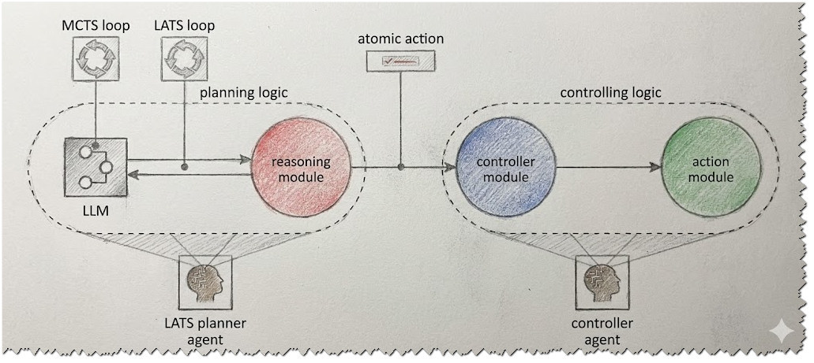

# Design Document: Language Agent Tree Search (LATS) Pattern

**Version:** 1.0
**Context:** Agentic AI Solution Design Patterns

---

## 1. Executive Summary
The **Language Agent Tree Search (LATS)** pattern is a sophisticated architectural strategy designed to overcome the limitations of linear reasoning in Agentic AI. By integrating Large Language Models (LLMs) with the **Monte Carlo Tree Search (MCTS)** algorithm, this pattern introduces deliberate exploration, self-correction, and multi-path evaluation. It allows an agent to simulate diverse hypothetical scenarios and select the optimal path before committing to a real-world action, significantly increasing decision-making robustness.

---

## 2. Problem Statement: The Linear Reasoning Trap
Standard prompting techniques like **Chain-of-Thought (CoT)** and execution patterns like **ReAct** primarily follow a single path of reasoning.
* **The Limitation:** If an early action or thought proves ineffective or leads to a dead end, the solution often struggles to recover or find the actual optimal path.
* **The Consequence:** Agents may commit to sub-optimal strategies without considering alternatives, leading to failure in complex environments where "backtracking" or weighing options is necessary.

---

## 3. Solution Overview
The LATS pattern augments the standard agent environment-interaction loop by adding an advanced search algorithm during the reasoning stage.

### Core Concept: MCTS + LLM
The pattern uses a variant of **Monte Carlo Tree Search (MCTS)** to create a tree structure of possible plans and outcomes.
* **Exploration:** The LLM proposes multiple diverse next steps or hypothetical scenarios (branches of the tree).
* **Evaluation:** The system simulates these scenarios to determine their probability of success.
* **Selection:** The agent chooses the best action from many options, similar to how humans consider multiple possibilities before acting.

---

## 4. Operational Workflow: The MCTS Loop
Instead of generating a single thought and action, the reasoning module performs an internal loop consisting of four distinct phases:

1.  **Selection Phase:** The planner agent repeatedly follows the most promising line of thought in its internal tree until it reaches a point where it can try a new, untested action.
2.  **Expansion Phase:** The agent adds a new hypothetical action to the tree, creating a starting point for a new test.
3.  **Simulation Phase:** The agent quickly "plays out" the full predicted scenario based on the new action. It assigns a **success score** (success/failure rating) to the outcome.
4.  **Backpropagation Phase:** The agent takes that final score and sends it back up the path, teaching every previous action in that branch whether it was a good or bad choice.

This loop typically iterates hundreds or thousands of times for every single real-world action, depending on resource availability.

---

## 5. System Architecture

### 5.1 The LATS Planner
The LATS loop occurs entirely within the **Reasoning Module's** interactions with the LLM.
* **Input:** The user request and current context.
* **Process:** The internal MCTS loop evaluates potential paths.
* **Output:** An **Atomic Action**—the single most valuable next step determined by the highest recorded average success rate.

### 5.2 Execution Flow
1.  The Reasoning Module performs the tree search.
2.  The optimal "Atomic Action" is produced.
3.  This action is forwarded to the **Controller Module**.
4.  The Controller executes the action.
5.  The process repeats for subsequent steps until the overall plan is complete.

---

## 6. Operational Example: Meeting Organization
*Scenario: Organize a meeting for 15 people in three weeks.*

* **Option 1 (Branch A):** Search for venues first, then check team availability.
    * *Simulation:* The LLM determines this is risky because availability might be low, leading to a dead end. Score: Low.
* **Option 2 (Branch B):** Check team availability first, then search for venues.
    * *Simulation:* The LLM determines this guarantees a fixed date, immediately narrowing the venue search. Score: High.
* **Decision:** The agent selects Option 2 as the Atomic Action to execute.

---

## 7. Trade-Off Analysis

This pattern represents a significant shift from speed to quality.

### Benefits
* **Robustness:** Highly resistant to dead ends and bad initial guesses.
* **Optimality:** Finds the *best* path, not just the *first* path.
* **Self-Correction:** capable of evaluating future failure states before they happen.

### Drawbacks
* **Resource Consumption:** Requires significantly more computational power and tokens due to the simulation of multiple branches.
* **Latency:** The internal search loop takes time, making this pattern slower than linear ReAct loops. It is best reserved for complex tasks where accuracy is paramount.

---
