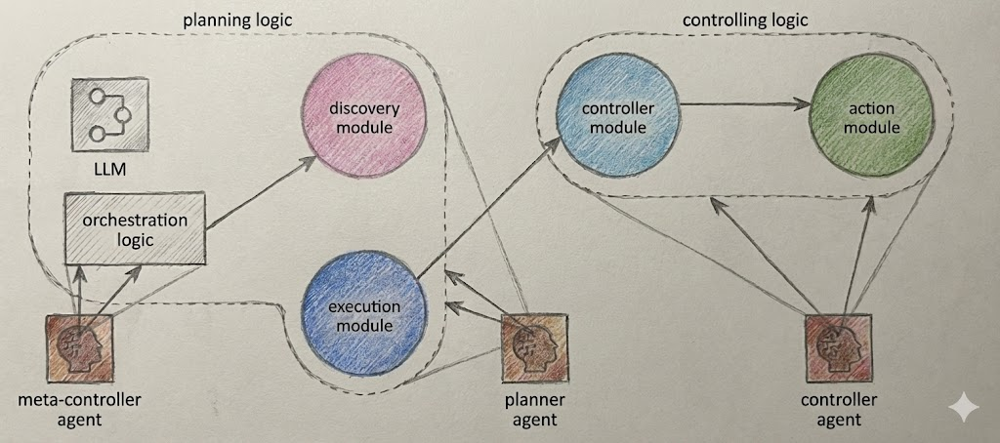

# Design Document: Self-Discover Pattern (Second-pass verification) 

**Version:** 1.0
**Context:** Agentic AI Solution Design Patterns

---

## 1. Executive Summary
The **Self-Discover** pattern is a sophisticated Agentic AI strategy designed to handle novel or highly specialized problems where standard, fixed reasoning loops (like ReAct) are insufficient. Instead of immediately attempting to solve a task, this pattern introduces a "Discovery" phase where the Large Language Model (LLM) first self-analyzes the problem to generate a custom, optimal reasoning structure. It effectively allows the agent to "program" its own thinking process before executing it, leading to a disciplined and expert-level approach to complex scenarios.

---

## 2. Problem Statement: The Limitations of Fixed Loops
Standard patterns like **ReAct** (Reason + Act) operate on a fixed cycle: *Thought → Action → Observation*. While effective for general tasks, this rigid structure has limitations:
* **Lack of Specialization:** It applies the same generic thinking process to every problem, regardless of nuance.
* **Inefficiency in Novelty:** For unique or high-stakes problems (e.g., zero-day vulnerability triage), a generic loop may miss critical constraints or dependencies that an expert would identify immediately.

---

## 3. Solution Overview: The Two-Stage Approach
The core concept of Self-Discover is to transform the planner's LLM into an expert on the specific problem *before* it attempts to solve it. This is achieved by splitting the workflow into two distinct stages managed by a **Meta-Controller**.

### 3.1 Stage 1: The Discovery Stage (Meta-Reasoning)
In this phase, the agent is explicitly prompted *not* to solve the task yet, but to determine *how* it should be solved.
* **Goal:** Generate a set of task-specific reasoning steps (a "Reasoning Structure").
* **Process:** The LLM decomposes the goal, identifies specific constraints (e.g., "check participant availability before checking venue"), and establishes an optimal sequence of operations.
* **Output:** A tailored thinking strategy or "program" for the specific task at hand.

### 3.2 Stage 2: The Execution Stage
In this phase, the reasoning structure generated in Stage 1 is integrated into the system prompt.
* **Goal:** Execute the plan linearly and strictly following the generated rules.
* **Process:** The agent follows the custom steps defined during discovery (e.g., "Step 1: Verify availability. Step 2: Select Venue").
* **Benefit:** The execution is disciplined and guided by a strategy explicitly designed for this exact scenario.

---

## 4. System Architecture

### 4.1 Components
* **Meta-Controller Agent:** The high-level coordinator that manages the transition between discovery and execution.
* **Discovery Module:** Interacts with the LLM to produce the reasoning structure.
* **Execution Module:** Integrates the reasoning structure and directs the Controller/Action modules.
* **Controller/Action Modules:** Handle the actual tool execution (e.g., API calls).

### 4.2 Data Flow
1.  **Meta-Controller** invokes the **Discovery Module**.
2.  **Discovery Module** prompts the LLM for a strategy and returns the **Discovery Results** (Reasoning Structure).
3.  **Meta-Controller** passes these results to the **Execution Module**.
4.  **Execution Module** prompts the LLM to solve the problem using the new structure.
5.  Instructions are sent to the **Controller**, and observations are returned to the **Execution Module** (allowing the LLM to maintain its self-programmed path).

---

## 5. Operational Example: Meeting Scheduling
*Scenario: Organize a team offsite meeting.*

1.  **Discovery Phase:**
    * *Agent Question:* "What is the most effective process for this?"
    * *Agent Output:* "1. Decompose into Scheduling, Venue, Logistics. 2. Constraint: Check participant availability BEFORE venue selection. 3. Sequence: Confirm date -> Select Venue."
2.  **Execution Phase:**
    * The system is now "locked" into this logic. It forces the agent to execute the "Check Availability" tool first, preventing the common error of booking a venue for an empty date.

---

## 6. Comparative Analysis: Self-Discover vs. LATS

The Self-Discover pattern is often compared to **Language Agent Tree Search (LATS)**, as both improve upon standard reasoning. However, their mechanisms differ fundamentally:

| Feature | Self-Discover Pattern | Language Agent Tree Search (LATS) |
| :--- | :--- | :--- |
| **Core Role** | **Strategy Generator.** | **Sequence Explorer.** |
| **Planning Approach** | **Front-loaded.** Generates the rules/plan upfront, then executes linearly. | **Step-by-Step.** Continually evaluates multiple future paths mid-task. |
| **Execution Style** | Disciplined execution of a pre-defined custom strategy. | Dynamic branching and backtracking during execution. |
| **Best For** | Problems requiring a specific expert *methodology* (e.g., regulatory analysis). | Problems requiring navigation of *uncertain outcomes* (e.g., complex games or puzzles). |

---

## 7. Use Cases
This pattern is ideal for "novel and unique" scenarios where a generic approach is risky:
* Customized supply chain risk assessment.
* Market entry strategy formulation.
* Zero-day security vulnerability triage.
* Regulatory change impact analysis.
* Non-standard customer conflict resolution.

## 8. Risks & Drawbacks
* **Unpredictability:** Because the agent invents its own logic path, behavior can vary significantly between runs.
* **Debugging Difficulty:** When the system fails, engineers must debug both the execution code *and* the reasoning logic the agent invented on the fly.

---

